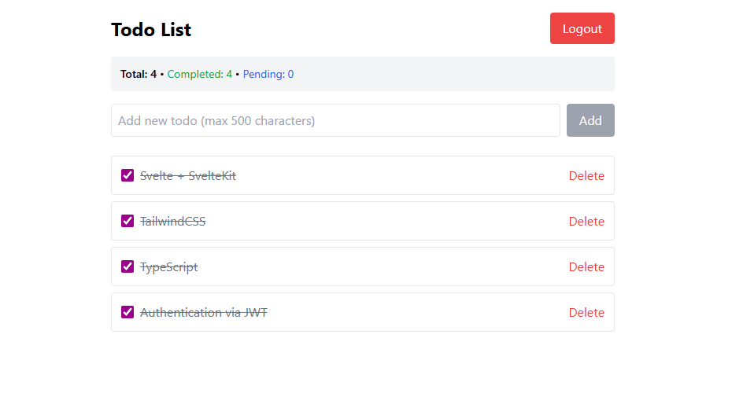

# sh-kit-db-selfauth-jwt

## commit legend

- baf: backend, auth, frontend respectively

## Techstacks

- Svelte + SvelteKit
- TailwindCSS
- TypeScript
- Authentication via JWT
- SQLite

## Features

✅ Todo
✅ Authentication w/ salting, JWT, and rate limiting
✅ Enhanced Password Security
✅ Input Validation with Zod
✅ Enhanced JWT Security
✅ Rate Limiting
✅ Security Headers & CSP
✅ Structured Logging
✅ Request Security Validation
✅ Database Security
✅ IP-Based Security
✅ Session Security

✅ JSON Web Token (JWT) for authentication
✅ Rate limiting to prevent brute force attacks
X Session fingerprinting
X CSRF protection
X CORS
X Password strength checking to ensure secure passwords
X Session fingerprinting to prevent session hijacking

## commit legend

- bpas: backend, api, auth, svelte respectively

## Screenshots - Home page



Everything you need to build a Svelte project, powered by [`sv`](https://github.com/sveltejs/cli).

## Developing

Once you've created a project and installed dependencies with `npm install` (or `pnpm install` or `yarn`), start a development server:

```bash
npm run dev

# or start the server and open the app in a new browser tab
npm run dev -- --open
```

## Building

To create a production version of your app:

```bash
npm run build
```

You can preview the production build with `npm run preview`.

> To deploy your app, you may need to install an [adapter](https://svelte.dev/docs/kit/adapters) for your target environment.
